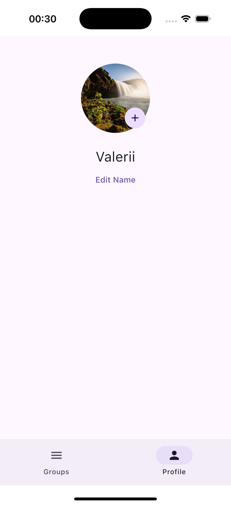
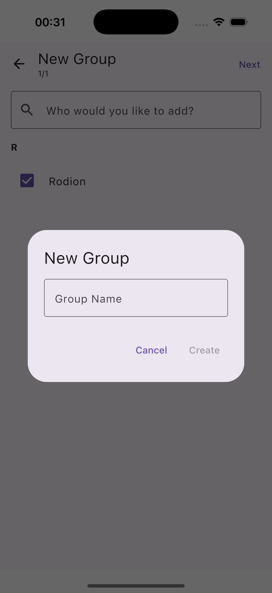
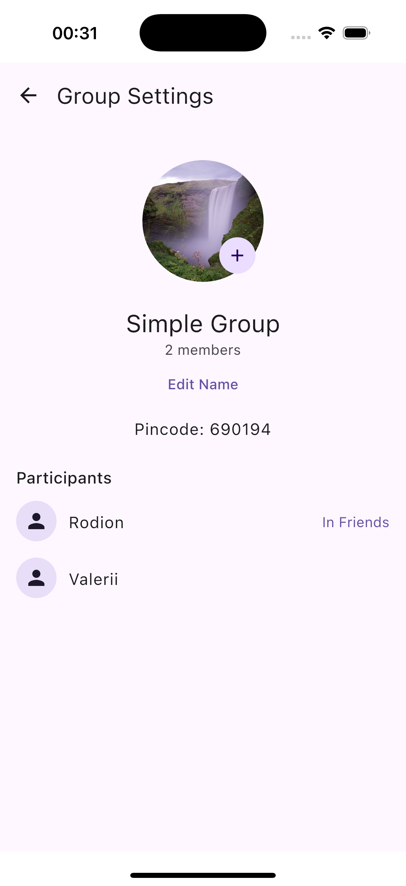
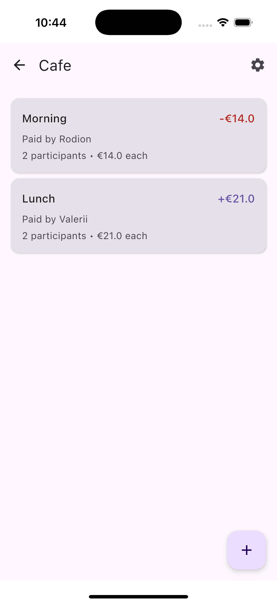
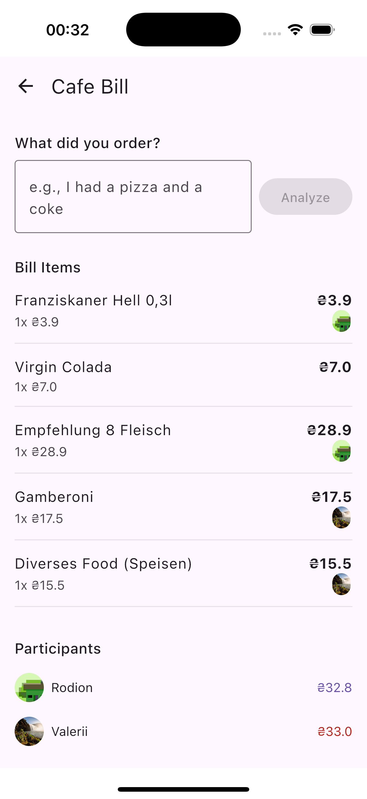

# PayFlo

## Table of Contents
- [Motivation and Background](#motivation-and-background)
- [Features](#features)
- [Screenshots](#screenshots)
- [Technical Implementation](#technical-implementation)
  - [Server](#server)
  - [LLM](#llm)
  - [Database](#database)
  - [UI](#ui)
  - [Backend](#backend)
- [How to run](#how-to-run)
  - [Server](#server-1)
  - [Android](#android)
  - [iOS](#ios)
  - [Gradle](#gradle)
  - [Future Steps](#future-steps)
    

**PayFlo** is a cross-platform mobile application (iOS & Android) that allows users to easily split bills between each other, with custom selection of participants. The main feature of the app is semantic search in the bill. Users can type in natural language what they bought/ordered, and then the app automatically calculates the position they ordered and total sum of it, based on the provided bill.

## Motivation and Background

This fall I took a course in mobile development, where I built an Android application in a group of 3. At the end of the project, I was a bit sad that it's available only on a single platform. So, I experimented a bit with Kotlin Multiplatform and built a simple project that displays movies from IMDB repository, and I built it for Desktop and Android. 

The problem I wanted to solve was that when a group of friends goes to a cafe, and one person closes the bill, it's quite hard to find the items in the bill/menu and calculate the whole sum you owe or owed. So, I decided to utilize the power of AI and its semantic search. So, all you need to do is attach a bill, and then in natural language just say what you ordered and it will automatically calculate the whole sum and show you the items. I tried to make the app as easy as possible, creating a very friendly UI, so the users dont spend time on complex feautures.

## Features

* **Profile Management**
  * Add profile picture
  * Change Name
  * Add Friends

* **Group Management**
  * Create new groups with selected friends
  * Join groups by ID
  * Track group expenses and balances
  * Add group picture / edit name

* **Smart Bill Splitting**
  * Upload bill images for automatic item detection
  * AI-powered order analysis 
  * Automatically assign items to group members based on their orders - you typed what u ordered, and app assign you automatically to the corresponding items from the bill
  * Support for both equal splits and item-based splits
 
## Screenshots

[Watch Demo Version](https://drive.google.com/file/d/1t4N10hN1JCAW9NeEFBSr6J9gNnW5myTb/view?usp=sharing)

<p align="center">
  
  
  
</p>

<p align="center">
  
  
</p>

## Technical Implementation

In this section, I describe what tradeoffs I had and some interesting moments that I encountered.

### Server

For the server side, I used `ktor` as I already had some experience with that. I used `REST API` model for my server, defining multiple endpoints for basic *CRUD* operations. I used `coroutines` and `ktor-serialization` libraries for efficiency and to avoid blocking the UI.

I implemented an `HTTP` Server and had to allow open traffic. Another interesting point was that, as I did not deploy the server, I had to use platform-specific URLs, because the Android emulator has a different URL `"http://10.0.2.2:8080"` instead of common `0.0.0.0:8080`

### LLM
Unfortunately, the open-source library [openai-kotlin](https://github.com/aallam/openai-kotlin) does not support image upload, so I defined methods to upload encoded images to the OPENAI API.

### Database
My application relies heavily on the database, and most of my methods modify/retrieve data. So, to avoid mistakes in syntax and for better maintainability, I used the exposed library as an ORM and SQLite as an engine to store my objects within a local file.

### UI
I used shared logic UI and all code was written in Kotlin with the `Compose Material3` library.

### BackEnd
For navigation purposes, I used `voyager`, and to update my UI I followed the common pattern of using `ViewModel` that triggers UI updates. To help me with this, I used Koin for better handling and managing these FlowStates.

However, one of the hardest parts for me was making picture uploading work, because this is where you access platform-specific functions, and I had to really dig deep to make it work. But once I made it, it was very easy to reuse later.


## How to run
1) Clone the repository: `git clone git@github.com:Valerii3/PayFlo.git`
2) Run `./gradlew build`

3) Configure OpenAI API Key
* Locate the file: `server/llm/ChatGPT.kt.`
* Insert your OpenAI API key in the appropriate field.
* To quickly find the correct location, search for `"Your API Key"` in the project files.
  
4) Possible: First-Time Run Issue (Fix)
When running the application for the first time and creating a group, you may encounter the following error due to missing dependencies across different modules:
```
java.lang.NoClassDefFoundError: dev.valerii.payflo.model.CreateGroupRequest
Caused by: java.lang.ClassNotFoundException: dev.valerii.payflo.model.CreateGroupRequest
```
Simply rerun the server, and the issue should be resolved.

5) To test the bill-splitting feature, an example bill image is provided:
   📂 `image/bill_example.png`

#### Server
6) Open project and access the `Application.kt` file under Server Folder
7) Run the main method in the `Application.kt` file

#### Android
To run your application on an Android emulator:

8) Ensure you have an Android virtual device available. Otherwise, create one.
9) Access the `MainActivity.kt` file in the `composeApp/androidMain/` folder

#### IOS
10) Open `iosApp` folder in Xcode and run the `IOSApp` file (entry-point to the application). Dont forget to select the device.

#### Gradle
Additionally, I created 2 tasks: detekt and diktat, to maintain clean and readable code :)) 
11) ./gradlew diktat


## Future Steps
1) **Currency Conversion Support**
* Implement automatic currency conversion to facilitate international transactions.
* Integrate real-time exchange rates to ensure accuracy.
* Allow users to set a preferred currency for their transactions.

2) **Optimized Expense Settlement Algorithm**
* Develop a smarter algorithm to minimize the number of transactions within a group.

3) **Additional Features & Enhancements**
* Continuous UI Enhancements
* Support for multiple bill images in a single transaction.
* Integration with payment gateways for seamless bill settlements.

## License
This project is licensed under the Apache License 2.0
   
